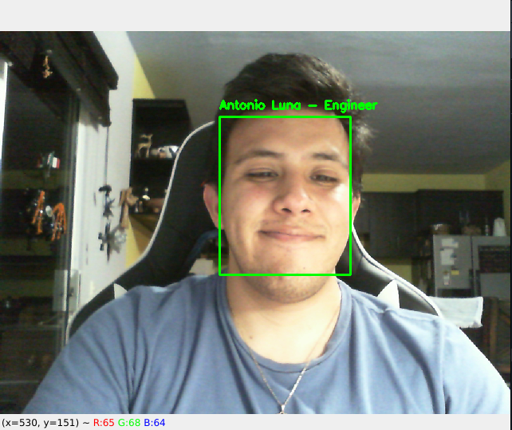

# Real-Time Face Recognition System

This project presents a real-time face recognition system built with Python, OpenCV, and PyTorch. It utilizes a pre-trained model from the `facenet_pytorch` library to generate embeddings from face images, which are then stored in a SQLite database. During real-time recognition, the system matches the face embeddings with the stored embeddings to identify individuals.



## Features
- Face Embedding Generation
- Real-Time Face Recognition
- SQLite Database Integration

## Installation
Clone this repository and install the required packages:
```bash
git clone https://github.com/your-username/real-time-face-recognition.git
cd real-time-face-recognition
pip install -r requirements.txt
```

## Usage
Run the following script to generate face embeddings from a dataset of images:
```bash
python generate_embeddings.py
Run the script below for real-time face recognition:
```

```bash
python real_time_recognition.py
```

## Database Schema
Refer to the SQLite database schema used to store face embeddings below:


## Face Recognition Workflow
Refer to the workflow of the real-time face recognition system below:


## Contributing
Feel free to fork this repository, create a new branch, make your changes, and submit a pull request.

## License
This project is licensed under the MIT License.

---

[Back to Top ↑](#real-time-face-recognition-system)
